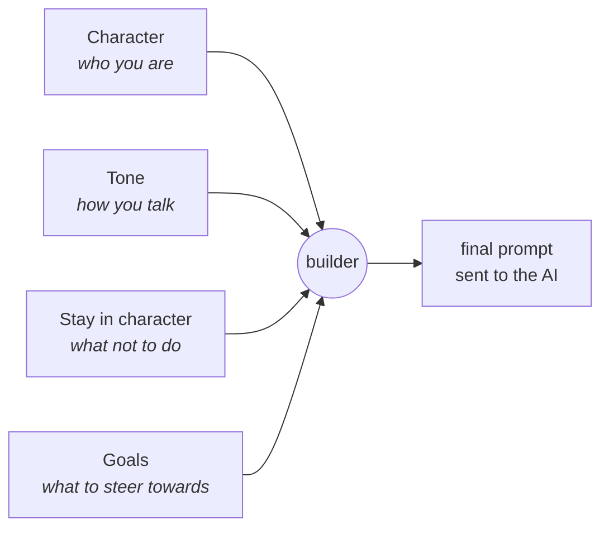
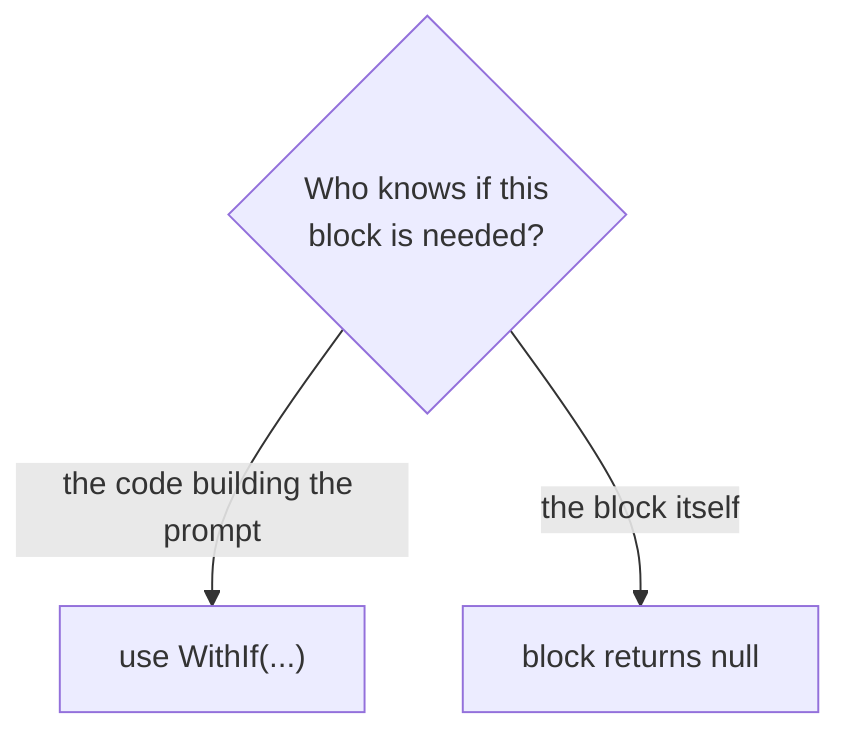
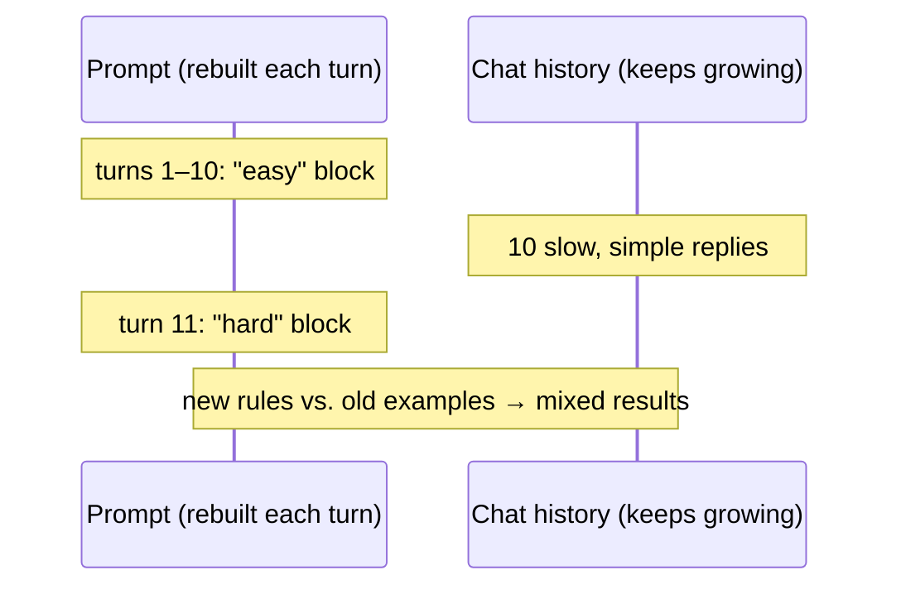
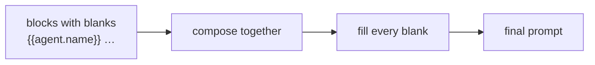
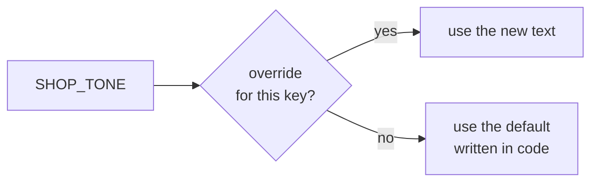
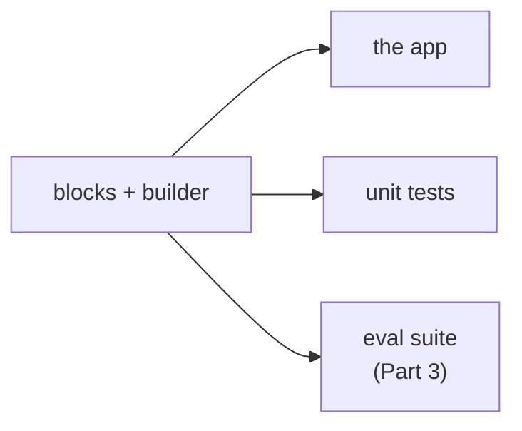
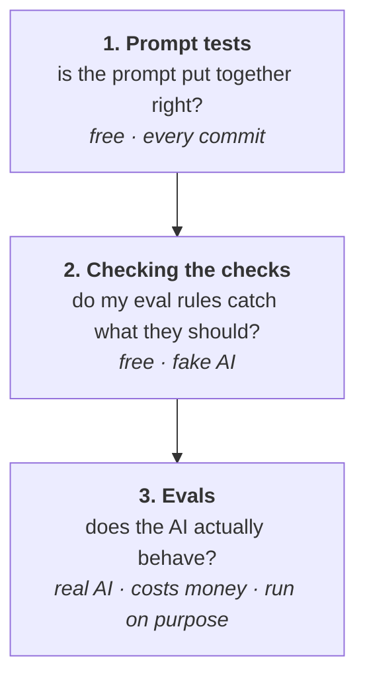
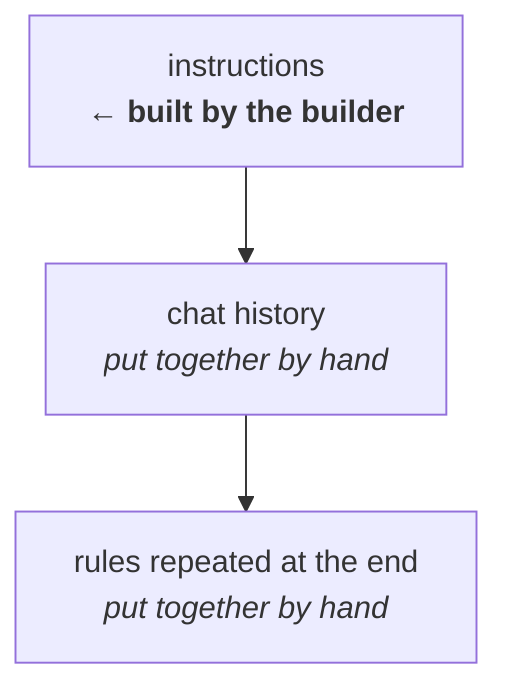
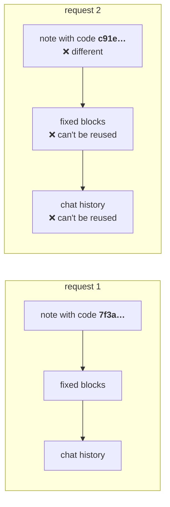

I've been working with [EaseTalk](https://www.easetalk.com) for a couple of months now. It's a speech therapy app, and a big part of it runs on AI. There are AI characters people can practise talking to, and a few quieter AI jobs running in the background, like removing personal details from transcripts and checking whether someone reached their practice goals.
Every one of those AI jobs runs on a **prompt**. If you haven't come across the word before, a prompt is just the text instructions we send to an AI model before it answers. Something like *"You're a friendly bookshop assistant. Keep your answers short. Don't talk about anything outside the shop."* The model reads that, then reads what the user said, and replies.

Sounds simple, right? It is, until the prompt starts growing.

To give you an idea of the size: across the app there are now about 740 lines of prompt text, split into 42 blocks with 67 variants between them. One single conversation turn sends the model around 1,700 words of instructions before it has even seen what the user said.

## Why one big string hurts
At first a prompt is a few lines in your code. Then you add a rule. Then a rule for one special case. Then an example, because the model keeps getting something wrong. Before you know it you have a wall of text that nobody wants to touch, because changing one line might quietly break something three paragraphs down. And it's not just me. Some researchers looked at **1,262 prompt changes** across 243 projects on GitHub. Only about **1 in 5** changes had a commit message that explained what changed, and most of those just said something like "improve prompt" ([Arxiv (Prompting in the Wild)](https://arxiv.org/abs/2412.17298)). Some changes even added rules that contradicted each other, like asking for a "meaningful length" answer and to "keep it short" in the same prompt. (I felt seen.)

The scary part is that small changes really matter. In another study, changing *only the formatting* of a prompt (spacing, separators, that kind of thing) shifted one model's score by up to **76 points out of 100** on some tasks ([Arxiv (How I learned to start worrying about prompt formatting)](https://arxiv.org/abs/2310.11324)). So I had a giant block of text that was hard to read, hard to review, easy to break, and impossible to test. That's basically the opposite of how I'd treat any other code.

So I stopped treating prompts as strings and started treating them like code.

## Blocks, like Lego

Here's the main idea: instead of one big prompt, I build it out of small pieces I call **blocks**. Each block does **one job**. One block says who the AI is. One says how it should talk. One says what to do if someone goes off topic. And so on.
Then a **builder** snaps them together in order, a bit like Lego, and out comes the final prompt.



Let's use a made-up bookshop chatbot as the example (the real ones look similar, just longer). A block is a small class:

```csharp
public class ToneBlock : IPromptBlock<BookshopChat>
{
    private const string Default = """
        Keep your answers short and friendly.
        Talk like a real person, not a robot.
        """;

    public IEnumerable<string> TemplateKeys => ["SHOP_TONE"];

    public Task<string?> RenderAsync(BookshopChat chat, IReadOnlyDictionary<string, string> overrides, CancellationToken ct = default)
        => Task.FromResult<string?>(overrides.GetValueOrDefault("SHOP_TONE") ?? Default);
}
```

Don't worry about `TemplateKeys` and `overrides` yet, I'll get to them in a bit. The important part is that the text lives in one small, named place.

And this is how a prompt gets put together:

```csharp
var prompt = await new BookshopPromptBuilder()
    .With(new CharacterBlock())
    .With(new ToneBlock()) // <-- this is the block we just made
    .With(new StayInCharacterBlock())
    .With(new GoalsBlock())
    .BuildAsync(chat);
```

The blocks show up in the prompt in the same order you list them. No magic.

### Why this helps

- **Easy to find things.** Want to change how the AI talks? Open `ToneBlock`. You don't have to scroll through 200 lines hoping you found the right paragraph.
- **Reviews make sense.** When someone changes a block, the code review shows exactly which job changed. "Updated the tone rules" is a lot easier to check than "changed line 147 of the big prompt". (Remember that "1 in 5" number from earlier?)
- **Reuse for free.** The "stay in character" block is used in more than one prompt. I write it once and plug it in wherever it's needed.
- **Room to grow.** Today the app has 42 blocks with 67 variants between them. Writing 67 versions of one giant string would have been a nightmare. With blocks, each variant is just a different block or a different version of one.

## Switching blocks on and off

Not every block belongs in every prompt. My bookshop bot doesn't need the "wrap up the conversation" block in the first minute. And a block about speaking Irish is useless if the chat is in English.
So blocks can be switched on and off. There are two ways to do it, and the difference matters more than you'd think.

**1. The builder decides, with `WithIf`.**

```csharp
var prompt = await new BookshopPromptBuilder()
    .With(new CharacterBlock())
    .With(new ToneBlock())
    .WithIf(chat => chat.Language == "ga-IE", new IrishLanguageBlock()) // <-- Only render this block, if the language is Irish
    .WithIf(chat => chat.AllGoalsDone, new WrapUpBlock()) // <-- Only render this block, if all goals are done
    .BuildAsync(chat);
```

The condition is checked every time the prompt is built, so it can change halfway through a chat. Once all the goals are done, the wrap-up block quietly shows up on the next turn.

**2. The block decides, by returning nothing.**
```csharp
public class DifficultyBlock : IPromptBlock<BookshopChat>
{
    public Task<string?> RenderAsync(BookshopChat chat, ...)
        => Task.FromResult<string?>(chat.Difficulty switch
        {
            "easy" => "Speak slowly and use simple words.",
            "hard" => "Talk at a normal pace, and be a little impatient.",
            _      => null   // nothing to say, so nothing is added
        });
}
```

If a block returns `null`, it just disappears from the prompt. No empty heading, no leftover gap.

### So which one do I use?
It comes down to one question: **who actually knows whether this block is needed?**

- **The code building the prompt knows** → use `WithIf`.
  The bookshop screen knows whether the chat is in Irish. The Irish block shouldn't have to check that itself.
- **The block itself knows** → let it return `null`.
  Only the difficulty block knows which of its versions to use, or whether any of them applies at all.



The nice side effect: when a block is missing from a prompt, I know exactly where to look for the reason.

### One quirk: the prompt changes, but the chat history doesn't

This one is niche, but it bit me, so I'll mention it.

The prompt is rebuilt on **every turn**, but the conversation history keeps growing. So if a block switches on or off halfway through a chat, the new instructions can disagree with what the AI has already said.

For example, say the chat starts on "easy" and the bot has been talking slowly with simple words for ten messages. Then the difficulty switches to "hard". The new prompt says "talk at a normal pace", but the history is full of the bot's own slow, simple replies. Now the model has two signals: the new instructions, and its own earlier messages showing it a different way of talking. It doesn't always pick the one you want.



It only happens when something switches **mid-conversation**, and luckily most of my blocks don't. If I ever need one that does... well, that's me engineering something new again. Oh lord. (future me's problem)

## Filling in the blanks

Blocks are mostly fixed text, but some bits change from chat to chat: the bot's name, the user's name, what the chat is about. So blocks can have little blanks in them, written like `{{this}}`:

```text
You are {{agent.name}}, working at {{shop.name}}.
You're chatting with {{user.name}}.
```

Each blank is called a **placeholder**, and I tell the builder where each one gets its value from:

```csharp
var placeholders = new PlaceholderResolver<BookshopChat>()
    .Trusted("agent.name", chat => chat.Agent.Name)
    .Trusted("shop.name",  chat => chat.Shop.Name)
    .Trusted("user.name",  chat => chat.User.Name);
```

The builder snaps all the blocks together first, then goes over the finished prompt **once** and fills in every blank.



That means any block can use any placeholder. A block doesn't need to know where the user's name comes from. It just writes `{{user.name}}`.

> *You might have spotted the word `Trusted` up there. That one word turned out to be the most interesting part of the whole system. Some of the values going into a prompt come from me, and some come from the user, and those two should *never* be treated or trusted the same way. That deserves its own post, so it's coming in Part 2.*

## Changing a block without touching the code

Remember the `TemplateKeys` and `overrides` I told you to ignore? Here's what they're for.

Every block has a **key**, which is just a name for its text:

```csharp
public IEnumerable<string> TemplateKeys => ["SHOP_TONE"];
```

When the prompt is built, I can hand the builder a list of **overrides**: replacement text for any key. If a block finds its key in that list, it uses the new text. If not, it falls back to its default.

```csharp
var overrides = new Dictionary<string, string>
{
    ["SHOP_TONE"] = "Be extra cheerful. Recommend one book you love."
};

var prompt = await builder.BuildAsync(chat, overrides);
```



Why bother? Because now I can try a different wording **without changing the code or redeploying**. Load the override from a database, or from a file in a test, and the exact same blocks build a slightly different prompt.

At least that was the plan when I built it, anyway. The idea was to keep these overrides in a database, so I could tweak a prompt in production without a release. Then reality kicked in: we have to follow standards like ISO, and they have strict rules about changing how the product behaves outside a proper release process. So I doubt that part will ever happen.

But it didn't go to waste! It turned out to be perfect for my eval suite, where I can swap in a different wording and compare the two side by side without touching any code. (More on that in Part 3. Honestly, my evals benefited from this way more than production ever would have, lol.)

One small safety net: an **empty** override doesn't wipe a block. If someone saves a blank value by accident, the block just ignores it and uses its default.

## Testing the prompt

Here's a question that sounds silly but isn't: **how do you know what your AI was actually told?**
With one big string, you read the string. With blocks, the real prompt only exists for a moment, when the builder puts it together. So I test that moment.

Because the prompt is built by code, I can test it like code.

The important bit: my tests don't have their own copy of the prompt text. They use the **same blocks and the same builder** as the app. There's no "test version" of the prompt sitting somewhere, slowly going out of date. If I change a block, the app and the tests both get the change.



The tests worth writing are about the **switching**, since that's the part with actual logic in it. For example: the wrap-up block should only appear once all the goals are done.

```csharp
[Fact]
public async Task WrapUpOnlyAppearsOnceGoalsAreDone()
{
    var before = await BookshopPrompt.Builder().BuildAsync(ChatWith(goalsDone: false));
    var after  = await BookshopPrompt.Builder().BuildAsync(ChatWith(goalsDone: true));

    Assert.DoesNotContain("wrap up", before);
    Assert.Contains("wrap up", after);
}
```

These don't call a real AI model, so they're fast, free, and run on every commit. That's actually just the first of three layers of testing I ended up with:



All three use the very same blocks and builder as the app, so they're all looking at the real prompt and not a copy. Layers 2 and 3 are where it gets interesting (and a bit weird, because the AI never answers the same way twice), so they get their own post: Part 3.

## "Why didn't you just use X?"
Fair question. I'm not the first person to have this problem, and there are tools out there for it. Here are the ones I looked at.

**Dotprompt** (from Google) keeps each prompt in its own file, with reusable bits you can include in other prompts. Nice idea, but there's no official .NET version ([Dotprompt](https://github.com/google/dotprompt)), and my backend is .NET. So that one was out.

**Prompty** (from Microsoft) also puts a prompt in a file, along with its settings, and it does have C# packages ([Prompty](https://github.com/microsoft/prompty)). It's the closest match to what I wanted. But I'd still have had to build a few things on top of it myself:

- the "block decides if it's needed" logic from earlier, which would move out of C# and into the file's own template language (Jinja2 or Mustache). That's a second language to learn, debug and review, when everything else, even the rules in my eval suite, is plain C#.
- the trusted vs untrusted handling (Part 2)
- a clean way for my eval suite to swap one block's text and measure the difference (Part 3)

At that point I'm writing most of it anyway, just around someone else's file format.

**DSPy** (from Stanford) is a different beast. It *is* a prompt engineering framework, but you don't write the prompt yourself. You describe what goes in and what should come out, and DSPy writes the prompt for you. Then, if you give it examples and a way to score answers, its optimisers can keep rewriting that prompt until it scores better ([DSPy](https://dspy.ai/current/)). Its tagline sums it up: *"Program, don't prompt."* It works really well in their papers ([Arxiv DSPy paper](https://arxiv.org/abs/2310.03714)). But it's Python only, it picks the prompt format itself, and tuning runs can cost real money: their own docs say some runs "can spend hundreds of dollars in LM calls".

It's also kind of the opposite of what I wanted. DSPy says "let the machine write the prompt". I wanted "a human writes the prompt, the machine checks it". In a speech therapy app I want to know exactly what the AI is being told, word for word.

(That said, I do want to try DSPy later as a one-off: let it look for a better wording on a small budget, then copy the result into a block and check it with my own evals. Watch this space.)

### So I wrote my own (small) one

I know, I know. "Built my own" is usually where people start rolling their eyes. (I would too.) So, honestly:

It's small, about 770 lines, and a good chunk of that is comments. It does exactly what my app needs and nothing else. Everything stays in C#, and my eval suite plugs straight into it.

The cost is that I own it. If something breaks, there's no community to ask, it's just me. And if Prompty grows the features I'm missing, I'd happily look at it again.

There's even a name for this idea. The [12-Factor Agents](https://github.com/humanlayer/12-factor-agents/blob/main/content/factor-02-own-your-prompts.md) guide has a rule called **"Own your prompts"**: *"Don't outsource your prompt engineering to a framework."* It also says you can do it with any tool you like, *"or even just template it manually."* So I'm not the only one who thinks this is fine.

## What I'd still fix

It's not perfect, and writing this post actually made me find a couple of things. (Writing about your code is a great way to review it, apparently.)

**1. The builder only builds part of the request.**
When the app talks to the AI, it doesn't send one prompt. It sends a list of messages: the instructions, then the chat so far, then a few important rules repeated at the end so the AI doesn't forget them halfway through a long chat.



My builder only makes the first one. The rest is put together by hand, separately in each kind of chat. And guess where the bug was? In one chat type, the rules at the end were added without going through the builder, so their placeholders never got filled in. The AI was literally being told about `{{agent.role}}`. The fix is to let the builder own the whole list of messages, so every part follows the same rules.

**2. My tests only looked at the first message.**
Which is exactly why bug number 1 slipped through. The prompt tests checked the instructions, but not the rules repeated at the end. Lesson learned: test the whole thing you send, not just the part you built.

**3. One place still keeps its own copy of the block list.**
I said earlier that tests and app share the same blocks. That's mostly true, but one pipeline still lists its blocks in two places. Small thing, but it's exactly the kind of copy that quietly goes out of date.

**4. I can't tell which prompt produced which answer.**
If an AI reply looks weird in the logs, I'd love to see the exact prompt version behind it. A small fingerprint of the final prompt stored next to each AI call would sort that out.

**5. Block order fights with caching, and I haven't solved it.**

Quick detour first, because this one needs a bit of background: **prompt caching**.

Every time the app talks to the AI, it sends everything again: all the instructions, plus the whole chat so far. The AI has to read all of it before answering, and you pay for every bit it reads.

But if the **start** of what you send is exactly the same as something you sent a few minutes ago, the provider can skip re-reading that part and reuse the work it already did. It's a bit like a local shop that knows your usual: say "the usual" and they're already halfway done before you finish talking. On Azure, which is what I use, the first 1,024 tokens (very roughly, 750 words) have to match **exactly**, and even one different character means no reuse ([source](https://learn.microsoft.com/en-us/azure/foundry/openai/how-to/prompt-caching)).

And here's my problem. To keep user text from being mistaken for instructions, some of my prompts start with a small note that includes a **random code**, and that code is different on every single request. (Why it has to be random, and why at the top, is a whole story, and that's Part 2.) So for those prompts the very first line is never the same twice, and the cache never kicks in. Not even once.



The obvious fix is to move that note further down, after the fixed blocks. But the order isn't random. The model has to be told what the random code means **before** it sees any of the text wrapped in it. And where an instruction sits can change how much attention the model pays to it: research has found models tend to use what's at the start or end of a long input better than what's in the middle ([source](https://arxiv.org/abs/2307.03172)). So moving things around for a cheaper bill could quietly make the AI worse at the exact thing the note is there for.

(A smaller version of the same problem: a few blocks change during the chat, like how far along the goals are, and they sit before the chat history. Every time one changes, the history can't be reused either.)

If I ever try reordering, my evals (Part 3) will have to tell me whether the cheaper order still behaves the same.

## Wrapping up

So that's the first part. If I had to squeeze it into a few lines:

- **Don't write one giant prompt.** Break it into small blocks, each doing one job.
- **Decide who switches a block on**: the code building the prompt, or the block itself. Then you always know where to look when one's missing.
- **Keep the changing bits as placeholders**, filled in once at the end.
- **Make the prompt testable**, using the same blocks in the app and in the tests, so there's never a stale copy.

None of this is fancy. It's mostly treating prompts the way I'd treat any other code. Small pieces, clear names, tests. The funny part is how long it took me to realise prompts deserved that too. (Or, how many times I had to break something before I got the hint.)

### What's next

- **Part 2: Not all text is equal.** Remember that word `Trusted`? Some text in a prompt comes from me, and some comes from the user. If you're not careful, a user can type something that the AI mistakes for instructions. Part 2 covers how I keep those apart, the random tags I wrap user text in, and why I'm honest that it still isn't bulletproof.
- **Part 3: Testing something that never answers the same way twice.** How I check that the AI actually *behaves* the way the prompt says: running the same case many times, pass rates instead of pass/fail, and using another AI as a judge (without blindly trusting it).

If you've built something similar, or think I've done something silly here, I'd genuinely love to hear it. Drop a note in the guestbook or drop an mail at alen@alenalex.me.