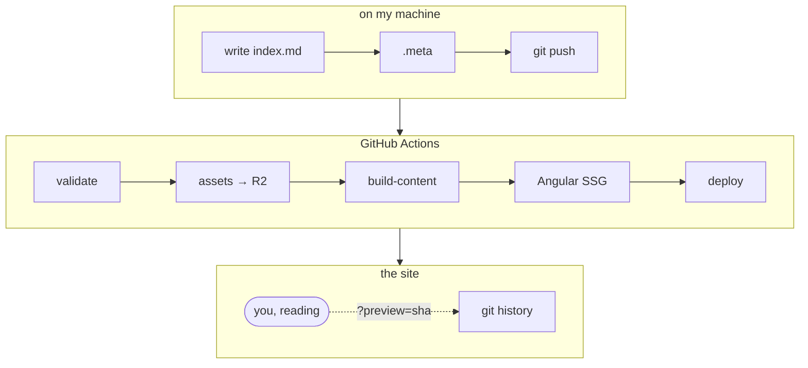
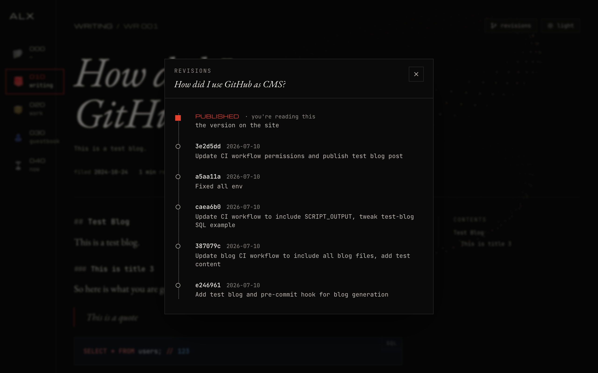
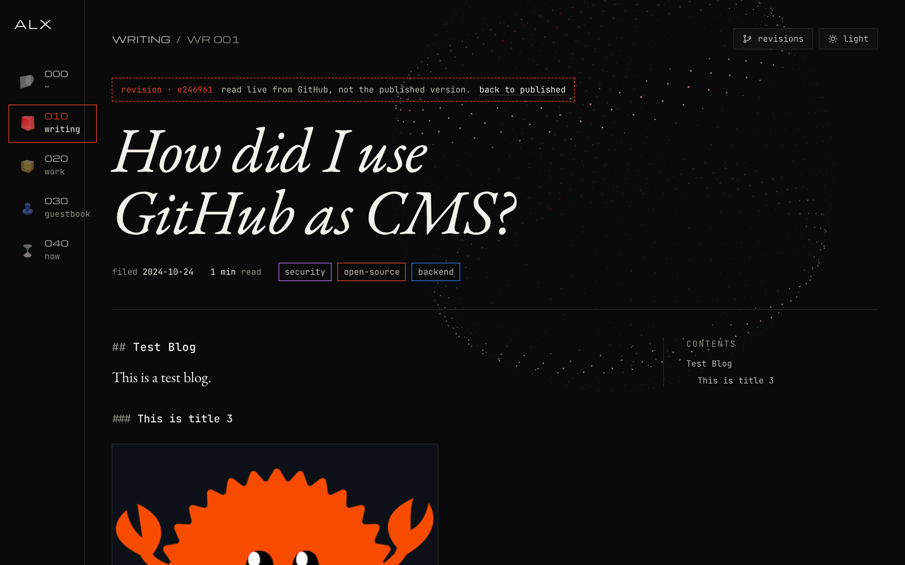

Every time I rebuilt this site, the blog was the part I dreaded. I tried a few hosted CMSs, a headless one, and a database-backed admin panel I wrote myself. They all worked. And with every one of them I ended up with a login I forgot, a database I had to back up, and posts that only existed somewhere I couldn't `grep`.

So this time the blog has no CMS. Or rather, the CMS is the repository you're probably reading this from: [github.com/AlenGeoAlex/alenalex.me](https://github.com/AlenGeoAlex/alenalex.me). A post is a folder, publishing is a push, and the edit history is `git log`.

## What I wanted

Before writing any code I wrote down what I actually wanted from a blog:

- **Write in my own editor.** Markdown, in the editor I already have open all day. No textarea in a browser tab.
- **History for free.** Every edit kept, every old version readable, without building a versioning system.
- **Drafts that are real pages.** I want to read a draft exactly as it will look when it's live, and send the link to someone, without it showing up in the list or in search.
- **Series.** Some topics need more than one post, and the parts should know about each other.
- **Static pages.** Each post should be plain HTML with its own title and preview card, so sharing a link on Discord or LinkedIn shows the right thing.
- **Media content that don't bloat the repo's hosting.** They should come from a CDN, not from the static host.
- **Nothing to run.** No server that has to be up for the blog to work.

Everything below is just how those turned into a pipeline.

## The whole flow

This is the full journey of a post, from the folder I write it in to the page you're reading:



The rest of this post walks through it top to bottom.

## A post is a folder

Every post lives in `blogs/`, in its own folder:

```text
blogs/
  repo-as-cms/
    .meta          ← what the post is
    index.md       ← the post
    assets/        ← its images
```

The `.meta` file is a few lines of YAML. This is the one for this post:

```yaml
title: "This repo is my CMS"
date: 2026-10-03
published: false
tags: ["github", "angular", "cloudflare", "ci-cd"]
excerpt: "No admin panel, no database, no editor in the browser."
```

The URL comes from the title (`/writing/this-repo-is-my-cms`), the excerpt goes into the listing and the preview card, and `published` is the only switch I ever flip.

A folder without a `.meta` is ignored. That turns out to be handy: I can start dumping notes into a folder long before I've decided it's a post.

### Drafts

`published: false` doesn't hide a post. It still gets built and gets a real URL, with a `draft` banner across the top and a `noindex` tag so search engines leave it alone. It just never shows up in the writing list or the RSS feed.

That means the review flow is: push the draft, open the link, read it the way a reader will. When I'm happy, change one line to `published: true` and push again.

### Series

A series is a folder of folders. The outer one gets a `series.meta` (title, description), and each part is a normal post folder inside it, with a `part:` number in its `.meta`:

```text
blogs/
  some-series/
    series.meta
    part-one/   .meta (part: 1) + index.md
    part-two/   .meta (part: 2) + index.md
```

Parts get nested URLs (`/writing/some-series/part-one`), a series page lists them in order, and each part links to the one before and after it.

There's one rule the build enforces: **parts go live in order**. If part 2 is published while part 1 is still a draft, the build fails. I'd rather get a red CI run than have a series that starts at chapter two.

## Assets live on R2

Images/Videos sit next to the post in `assets/` and I reference them the normal markdown way, so they preview fine in my editor and on GitHub:

```md

```

At build time those paths are rewritten to Cloudflare R2, under a key that mirrors the folder:

```text
https://assets.alenalex.me/assets/hotlink-ok/repo-as-cms/revisions.png
```

The `hotlink-ok` bit is a path I exempt from Cloudflare's hotlink protection, so these images can be embedded anywhere while everything else on the bucket stays protected.

The upload is done by a small C# generator in the repo. It has two commands: `validate`, which checks every post (the `.meta` fields, part numbers and publish order, and that every image the markdown points at actually exists, with the exact same case), and `sync`, which uploads the `assets/` of the posts that changed in that push. The deploy waits for the sync, so a page never goes live before its images exist.

## From markdown to static pages

The site is Angular, but no markdown is parsed in your browser for a published post. A build step, `build-content`, runs before every build and turns `blogs/` into JSON:

- every post rendered to HTML, with headings collected for the contents sidebar
- code highlighted with [Shiki](https://shiki.style) in **both** a dark and a light theme, so the reader toggle can switch them with CSS alone
- `mermaid` code blocks left as diagrams, like the one above
- image paths rewritten to R2
- a reading time, an excerpt, and the RSS feed

Then Angular's static site generation takes over. The router knows the list of posts from that JSON, so the build prerenders every one of them, drafts included, into its own `index.html` with the right `<title>`, description and Open Graph tags. The post's HTML is baked into the page and handed to the app, so when Angular wakes up in the browser it doesn't fetch the post a second time.

What gets deployed is just a folder of HTML, JS and JSON on Azure Static Web Apps. There's no server in the path of a reader opening a post.

## Git history is the revision history

This is the feature I wanted most and had to build least for.

Every edit to a post is already a commit that touches its folder. So the **revisions** button on a post asks GitHub for the commits on `blogs/<folder>` and draws them as a timeline: date, commit message, short sha.


Clicking one opens the post at `?preview=<sha>`. That fetches the `.meta` and `index.md` *as they were at that commit*, renders them in the browser, and shows a banner saying which version you're looking at. Typos I fixed, paragraphs I cut, the first version of a post before someone told me it was wrong: all of it is still readable, and I never wrote a line of versioning code. It's also how I preview a branch before merging it.



## Shipping is a push

Two GitHub Actions workflows tie it together:

1. **`blog.yml`** runs when anything under `blogs/` changes. It tests the generator, validates every post, and syncs the changed posts' images to R2.
2. When that's green, it calls **`site.yml`**, which runs `build-content`, does the Angular build with prerendering, and deploys to Static Web Apps.

`site.yml` also runs on its own when I change the site itself, and both can be triggered by hand. From pushing a commit to seeing the post live takes a couple of minutes, and if anything in a post is broken, the run fails before anything is deployed.

## That's it

So the whole "CMS" is a folder convention, a build script, and two workflows. Writing a post looks like writing anything else in my editor, drafts are links I can share, and the history of every post is one click away for anyone who's curious.

And if you spot a typo here, you know where the source is. Pull requests welcome.
