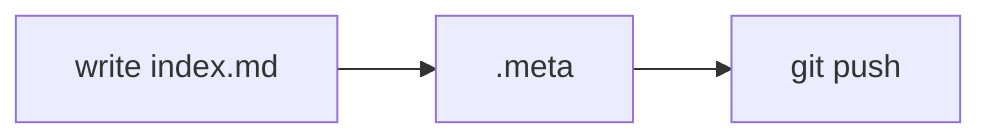

I have rebuilt this site quite a few times now, and the blog was always the part that never made it out. Every attempt started simple, then I kept adding requirements to it (I'm a bit of a perfectionist), it got way too ambitious, and somewhere along the way it just got abandoned.

So this time I tried to keep it simple and didn't use a CMS at all. The repo itself is the CMS, and it's public: [github.com/AlenGeoAlex/alenalex.me](https://github.com/AlenGeoAlex/alenalex.me). Every post is a folder, I publish by pushing to main, and the edit history is just the git history.

## What I wanted

Before I started, I wrote down what I actually wanted from the blog:

- **Write in my own editor.** Markdown, in the same editor I use all day. I don't want to type a post into a textbox on some website. (but first I have to build it lol)
- **History without building it.** Every edit should be kept and every old version should be readable, without me writing any versioning logic. (yeah, my most ambitious one)
- **Drafts as real pages.** I want to see a draft exactly how it will look when it's live, and share the link with someone, but it shouldn't show up in the list or on Google.
- **Series.** Some topics are too big for one post, so I wanted parts that link to each other.
- **Static pages.** Every post should be its own HTML page with its own title and preview card, so the link looks right when I share it on Discord or LinkedIn. (more like an SEO thing)
- **Media from a CDN.** Images and videos shouldn't be served from the static host.
- **Nothing to keep running.** No server that has to be up just for someone to read a post. (I already have enough things to babysit)

And two things that were more of a nice to have:

- **Diagrams as text.** I didn't want to draw a diagram somewhere, export a PNG and redo it every time something changes.

The rest of this post is basically how all of that fits together.

## The whole flow

This is what happens to a post, from writing it to it being live:


I'll go through each part below.

## A post is a folder

Every post is a folder inside `blogs/`:

```text
blogs/
  repo-as-cms/
    .meta          ← details about the post
    index.md       ← the post itself
    assets/        ← images and videos
```

`.meta` is a small YAML file. This is the one for this post:

```yaml
title: "This repo is my CMS"
date: 2026-10-03
published: false
tags: ["github", "angular", "cloudflare", "ci-cd"]
excerpt: "No CMS and no database. The posts are just folders in this repo, and pushing to main publishes them."
ai-assist: true
```

The URL is made from the title (`/writing/this-repo-is-my-cms`), and the excerpt is what shows in the list and in the link preview. `published` is the one I actually change, and I'll come to `ai-assist` later.

If a folder doesn't have a `.meta`, it's just ignored. I can keep notes for a post in a folder for weeks and nothing happens until I add the `.meta`.

### Drafts

`published: false` doesn't hide the post. It still gets built and has a proper URL, it just has a `draft` banner on top and a `noindex` tag so search engines skip it. It won't show up in the writing list or in RSS.

So my flow is, push it as a draft, open the link and read it like a reader would, fix stuff (there's always stuff), and when I'm happy change it to `published: true` and push again.

### Series

A series is a folder with more post folders inside it. The outer folder has a `series.meta` with the title and description, and each part is a normal post folder with a `part:` number in its `.meta`:

```text
blogs/
  some-series/
    series.meta
    part-one/   .meta (part: 1) + index.md
    part-two/   .meta (part: 2) + index.md
```

Parts get URLs like `/writing/some-series/part-one`, there's a page for the series that lists all the parts in order, and each part links to the previous and next one.

The build also checks that parts are published in order. If part 2 is published while part 1 is still a draft, the build fails, so I can't accidentally publish a series from the middle.

## Assets live on R2

Images and videos go in the `assets/` folder of the post, and I link them normally in markdown, so they also show up fine in my editor and on GitHub:

```md

```

When the site is built, these paths are changed to point to Cloudflare R2, using the same folder structure:

```text
https://assets.alenalex.me/assets/hotlink-ok/repo-as-cms/revisions.png
```

`hotlink-ok` is a path I excluded from Cloudflare's hotlink protection, so these can be embedded anywhere while the rest of the bucket is still protected.

The upload is done by a small C# generator that lives in the same repo. It has two commands. `validate` checks every post, like the `.meta` fields, part numbers, publish order and whether every image used in the markdown actually exists (with the same case, since R2 is case-sensitive). `sync` uploads the `assets/` of the posts that changed in that push. The deploy only runs after the sync, so a post never goes live before its images are there.

## From markdown to static pages

The site is built with Angular, but for published posts, the markdown is never parsed in the browser. There's a build step called `build-content` that runs before every build and turns `blogs/` into JSON. It does a few things:

- renders every post to HTML and collects the headings for the contents sidebar
- highlights code with [Shiki](https://shiki.style) in both a dark and a light theme, so switching the theme is just CSS
- keeps `mermaid` code blocks as diagrams (more on that below)
- changes image paths to the R2 URLs
- works out the reading time and excerpt, and writes the RSS feed

After that, Angular's static site generation (prerendering) takes over. The router gets the list of posts from that JSON and builds every post into its own `index.html`, drafts too, each with the correct `<title>`, description and Open Graph tags. The post HTML is already inside the page, so when Angular loads in the browser it doesn't have to fetch the post again.

What gets deployed to Azure Static Web Apps is just HTML, JS and JSON files. There's no server involved when someone opens a post.

## Git history is the revision history

This was the feature I wanted the most, and it was also one of the easier ones, since git already does the hard part.

Every edit to a post is already a commit. So the **revisions** button on a post asks GitHub for the commits that changed that post and shows them as a timeline with the date, the commit message and the short sha.

I didn't want every commit there though, so there are a few rules:

- Only commits that changed `index.md` are shown. Changing tags, publishing it or adding a screenshot doesn't count as a revision.
- If a commit message has `[skip rev]` in it, it's not shown, similar to how `[skip ci]` works. It's still on GitHub, it just isn't in the timeline.
- `revisions-since:` in `.meta` makes the list start from a certain date, so all the messy commits from before the post was published don't show up.


Clicking a commit opens the post with `?preview=<sha>`. That gets the `.meta` and `index.md` from that commit, renders it in the browser, and shows a banner with which version you're looking at. So the older versions, typos, removed paragraphs and all, are still there to read, and I didn't have to write any versioning code for it. I also use the same thing to preview a branch before merging it.


## The two nice to haves

### Diagrams with mermaid

The diagram at the top of this post isn't an image, it's a [mermaid](https://mermaid.ai/open-source/) code block in the markdown:

````md

````

The build keeps these blocks as they are, and the browser draws them when the post is opened. Mermaid is only loaded on posts that have a diagram, so the other pages don't get any heavier. The diagrams use the site's fonts and colours, and they get redrawn when you switch between light and dark.

Since the diagram is just text, changing it is a small diff, it shows up in the revisions like any other change, and GitHub can render the same block when you look at the source.

### Saying when AI helped

Every post can mention if AI was used to write it, using one line in `.meta`:

```yaml
ai-assist: true    # or false
```

If it's `true`, there's an **ai-assisted** mark next to the reading time, and hovering it says AI was used in some capacity to write the post. If it's `false`, it shows **no ai** instead. If I don't add the key, nothing is shown, and the validator fails if the value is anything other than `true` or `false`.

I just prefer to be honest about it. This post has it set to `true`, you can see it at the top.

## Shipping is a push

There are two GitHub Actions workflows:

1. **`blog.yml`** runs when something in `blogs/` changes. It runs the generator's tests, validates all the posts, and syncs the images of the changed posts to R2.
2. If that passes, it calls **`site.yml`**, which runs `build-content`, builds the Angular site with prerendering, and deploys it to Static Web Apps.

`site.yml` also runs by itself when I change something in the site, and I can trigger both manually. From a push to the post being live takes a couple of minutes, and if something in a post is wrong, the run fails before anything gets deployed.

## What's next

The one thing I still want to add is a comment section on each post, so people can reply to a post right below it instead of finding me somewhere else. It's on the list, hopefully it doesn't get too ambitious this time.

## That's it

So the "CMS" is really just a folder structure, a build script and two workflows. I write posts in my editor like any other file, drafts are links I can share, and anyone can see how a post changed over time.

And if you find a typo, you know where the source is, feel free to open a PR.
